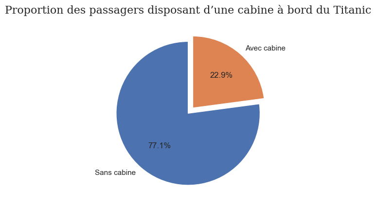

# Titanic Dataset – Exploratory Data Analysis (EDA)

##  Description du projet
Ce projet consiste à réaliser une **analyse exploratoire des données (EDA)** du dataset Titanic.  
L’objectif est de comprendre la structure des données, d’identifier les valeurs manquantes, d’analyser les distributions des variables numériques et catégorielles, et d’évaluer l’impact des différentes méthodes d’imputation.

## Dataset
- **Source** : [Titanic dataset](https://www.kaggle.com/datasets/yasserh/titanic-dataset)
- **Nombre d’observations** : 891 passagers
- **Nombre de variables** : 12

### Principales variables :
- `Survived` : statut de survie (0 = non, 1 = oui)
- `Age` : âge du passager
- `Fare` : prix du billet (en livres sterling, 1912)
- `Sex` : sexe du passager
- `Pclass` : classe du billet
- `Embarked` : port d’embarquement
- `Cabin` : cabine du passager

---

## Analyse exploratoire

### Analyse des valeurs manquantes

L’analyse des données montre que **trois colonnes contiennent des valeurs manquantes** : **Age**, **Embarked** et **Cabin**.  
La colonne *Age* comporte environ **19,9 %** de valeurs manquantes, tandis que *Embarked* en contient très peu (**0,2 %**). En revanche, la colonne *Cabin* présente un taux très élevé de valeurs manquantes (**77,1 %**).

Pour éviter de perdre beaucoup d’informations, les valeurs manquantes de la colonne *Cabin* ont été remplacées par la valeur **"Unknown"**.  
Pour les colonnes *Age* et *Embarked*, des méthodes d’imputation ont été appliquées. Ces méthodes seront expliquées plus en détail dans les sections suivantes.

> **Note :** L’énoncé indique que la colonne *Fare* contient des valeurs manquantes. Cependant, dans le DataFrame utilisé pour cette analyse, aucune valeur manquante n’a été observée dans cette colonne. Aucun traitement n’a donc été nécessaire pour *Fare*.

### Analyse des distributions

#### Distribution de l’âge et du prix des billets

La distribution de l’âge des passagers est **quasi symétrique**. Cela s’explique par le fait que la **moyenne (≈ 29,7 ans)** et la **médiane (≈ 28 ans)** sont très proches, ce qui indique une répartition relativement équilibrée autour de la valeur centrale.

En revanche, la distribution du **prix des billets (Fare)** est **asymétrique à gauche**. La majorité des passagers a payé un prix relativement faible, tandis que quelques billets très chers étirent la distribution.

---

#### Présence de valeurs aberrantes dans la colonne Fare

Oui, la colonne **Fare** contient des **valeurs aberrantes**.

Sur le boxplot, les valeurs aberrantes correspondent aux **points situés au-delà de la borne supérieure**, définie par la formule :

> **Upper fence = Q3 + 1,5 × IQR**

Ces valeurs représentent des billets **anormalement chers**, principalement associés à des passagers de **première classe**. Elles expliquent la forte asymétrie observée dans la distribution de Fare.

---

#### Classe la plus représentée dans le dataset

La **classe 3** est la plus représentée dans le dataset. Cela indique que la majorité des passagers du Titanic voyageait en **troisième classe**, ce qui est cohérent avec le contexte historique du transport maritime de l’époque.

---

#### Visualisation des variables catégorielles (Bonus)

Les diagrammes circulaires permettent de visualiser rapidement la **répartition des passagers selon le sexe, le port d’embarquement et la classe**.  
Ce type de graphique est particulièrement efficace pour comparer des **proportions** et offre une lecture intuitive de la composition du dataset.

### Nettoyage et visualisation comparative

#### Imputation de la variable Age

Pour la variable **Age**, trois méthodes d’imputation ont été testées afin de remplacer les valeurs manquantes :
- imputation par la **moyenne**,
- imputation par la **médiane**,
- imputation par le **mode**.

L’objectif est de comparer l’impact de ces méthodes sur la distribution de l’âge des passagers.

À partir de cette comparaison, on observe que l’imputation par la **médiane** est celle qui préserve le mieux la distribution originale de l’âge. Les positions des quartiles et la médiane restent proches de celles observées avant imputation.

L’imputation par la **moyenne** peut introduire un léger **pic artificiel** autour de la valeur moyenne, car toutes les valeurs manquantes sont remplacées par une même valeur centrale, ce qui modifie légèrement la distribution.

En revanche, l’imputation par le **mode** affecte fortement la médiane de la variable Age, comme le montre le graphique. Cette méthode n’est pas pertinente pour l’âge, car il s’agit d’une variable continue : remplacer les valeurs manquantes par une seule valeur fréquente fausse la distribution et réduit la variabilité des données.

---

#### Imputation de la variable Embarked

Pour la variable **Embarked**, la valeur **modale** est le port **S (Southampton)**.  
Les valeurs manquantes ont donc été imputées par **S**, qui est la modalité la plus fréquente.

La comparaison des diagrammes en barres avant et après imputation montre que cette opération n’a que très peu modifié la distribution globale, car le nombre de valeurs manquantes était faible.

Les diagrammes circulaires confirment cette observation : les proportions des ports d’embarquement restent quasiment identiques après imputation. L’imputation par la valeur modale est donc une approche adaptée pour cette variable catégorielle.

### Conclusion finale

Cette analyse exploratoire a permis de mieux comprendre la structure du dataset Titanic et d’identifier les principaux défis liés aux valeurs manquantes et à la distribution des variables. Les colonnes **Age**, **Embarked** et **Cabin** contenaient des valeurs manquantes, nécessitant des stratégies de traitement adaptées.  
Pour la variable **Age**, l’imputation par la **médiane** s’est révélée la plus appropriée, car elle préserve le mieux la distribution originale. L’imputation par la moyenne peut introduire un biais, tandis que l’imputation par le mode n’est pas pertinente pour une variable continue.  
Concernant **Embarked**, l’imputation par la valeur modale (**S**) s’est avérée efficace et n’a pas modifié significativement la distribution. Enfin, pour la colonne **Cabin**, le remplacement des valeurs manquantes par **"Unknown"** a permis de conserver l’ensemble des données sans perte importante d’information.

Dans l’ensemble, ces étapes de nettoyage et de visualisation comparative constituent une base solide pour des analyses plus avancées et une éventuelle modélisation prédictive.

---

### Analyses complémentaires possibles

Plusieurs analyses pertinentes peuvent être envisagées pour approfondir l’étude du dataset :

- **Analyse de la survie (`Survived`)**  
  Étudier le taux de survie en fonction de variables comme le sexe, la classe ou l’âge.

- **Relation entre le prix du billet et la classe**  
  Analyser comment le prix du billet varie selon la classe et son lien avec la survie.

- **Impact de l’âge sur la survie**  
  Comparer les distributions d’âge entre survivants et non-survivants.

- **Analyse des variables familiales (`SibSp`, `Parch`)**  
  Étudier si voyager seul ou en famille a influencé les chances de survie.

- **Encodage des variables catégorielles**  
  Préparer les données pour la modélisation en encodant les variables comme `Sex`, `Embarked` et `Cabin`.

- **Modélisation prédictive**  
  Mettre en place des modèles simples (régression logistique, arbre de décision, random forest) afin de prédire la survie des passagers.

Ces analyses permettraient de tirer des conclusions plus approfondies et de valoriser davantage le dataset dans un contexte de data science ou de machine learning.

